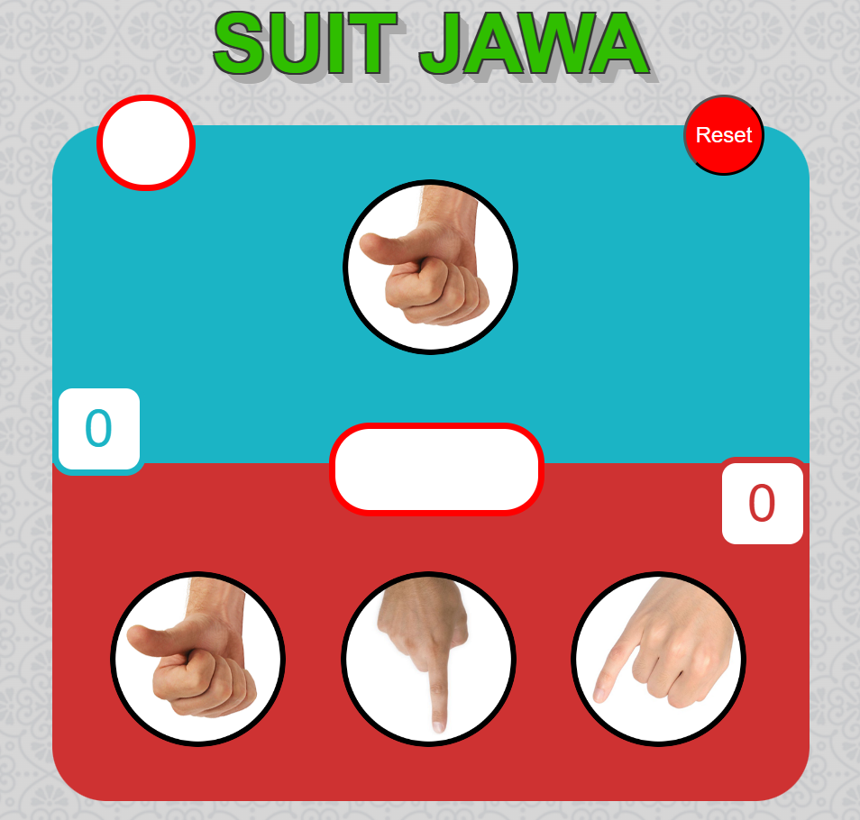
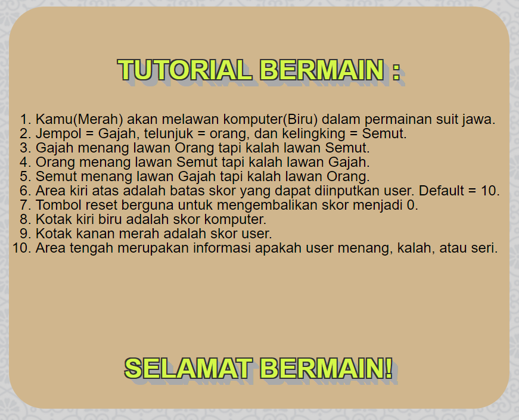

<h1>Suit Jawa Using Javascript</h1>
<h2>Tutorial :</h2>
<ol type="1">
    <li>Kamu(Merah) akan melawan komputer(Biru) dalam permainan suit jawa.</li>
    <li>Jempol = Gajah, telunjuk = orang, dan kelingking = Semut.</li> 
    <li>Gajah menang lawan Orang tapi kalah lawan Semut.</li>
    <li>Orang menang lawan Semut tapi kalah lawan Gajah.</li>
    <li>Semut menang lawan Gajah tapi kalah lawan Orang.</li> 
    <li>Area kiri atas adalah batas skor yang dapat diinputkan user. Default =  10.</li>
    <li>Tombol reset berguna untuk mengembalikan skor menjadi 0.</li>
    <li>Kotak kiri biru adalah skor komputer.</li>
    <li>Kotak kanan merah adalah skor user.</li>
    <li>Area tengah merupakan informasi apakah user menang, kalah, atau seri.</li>
</ol>
  
<h2>Preview Website : </h2>

